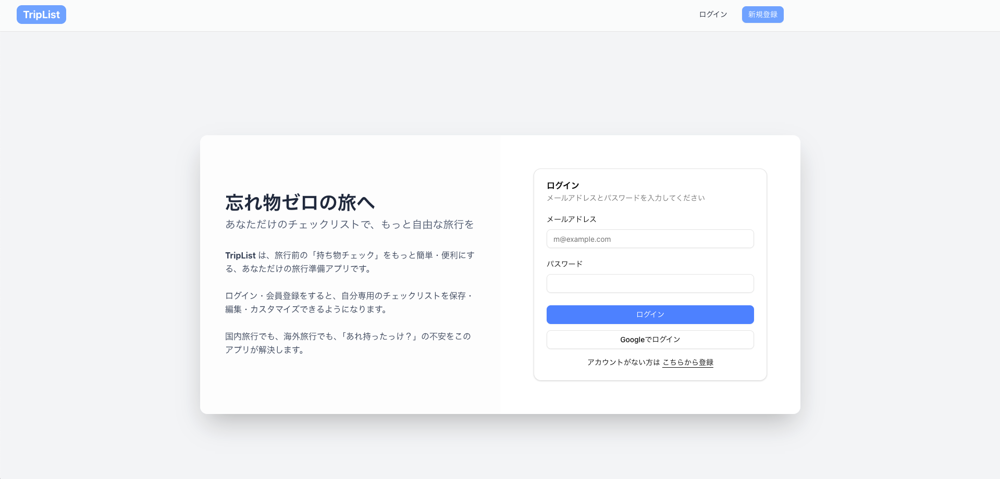
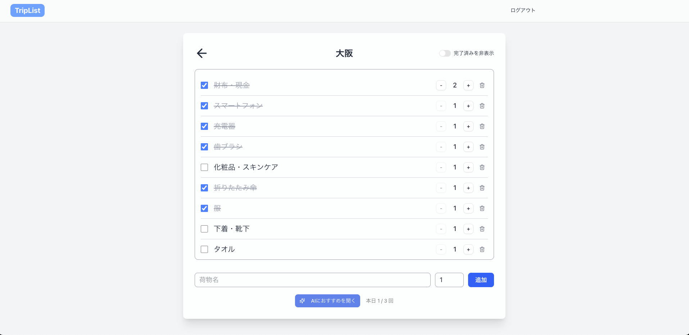
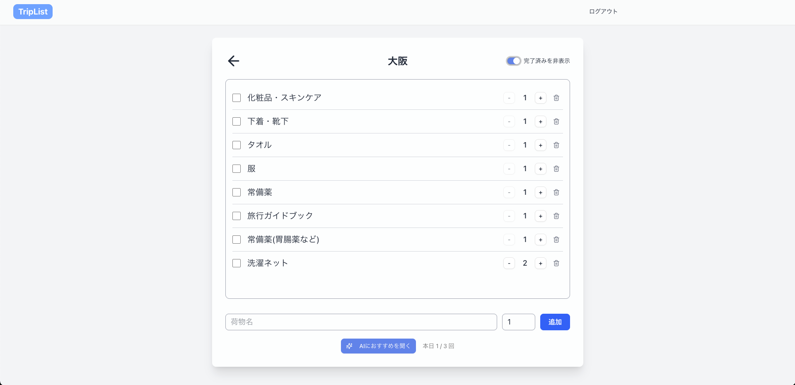
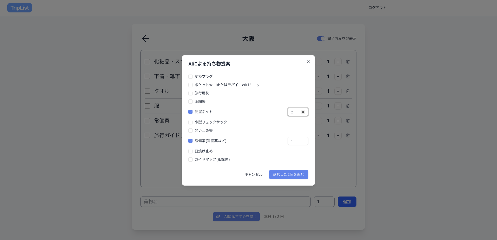

## 本リポジトリについて

ハッカソン制作作品「[Triplist](https://github.com/tea35/trip)」の継続開発版

# TripList

旅行プランの荷物を管理する Web アプリケーション



## 概要

TripList は、旅行ごとに荷物のチェックリストを簡単に作成・管理する Web アプリケーションです

## 主な機能

- **旅行プラン作成**: 目的地、日程を設定して新しい旅行プランを作成
- **旅行リスト管理**: 作成した旅行プランの一覧表示・編集・削除
- **チェックリスト**: 持ち物や準備項目のチェックリスト機能
- **ユーザー認証**: ログイン・新規登録機能(Google 認証可能)
- **レスポンシブデザイン**: PC・スマートフォン対応

## 技術スタック

- **フロントエンド**: Next.js 14 (App Router)
- **バックエンド**: Next.js API Routes
- **データベース**: Supabase
- **認証**: Supabase Auth
- **スタイリング**: Tailwind CSS
- **UI コンポーネント**: shadcn/ui
- **地図 API**: Google Maps API
- **言語**: TypeScript
- **LLM**: Gemini

## 工夫点

- 場所の入力を利用して、地図 API から緯度経度を取得し、国内外の判定を行いテンプレートの分岐を行っている([Triplist](https://github.com/tea35/trip)時点で作成)
- チェックがついた荷物を非表示にできるトグルを作成した

<table>
  <tr>
    <td></td>
    <td></td>
  </tr>
</table>

- 回数制限はあるものの LLM が新規の荷物を提案し、ユーザが選択できるようにした
<div style="text-align: center;">
  
</div>

## セットアップ

### 必要な環境

- Node.js 18 以上
- npm または yarn

### インストール

```bash
# リポジトリをクローン
git clone https://github.com/tea35/trip_v2.git
cd trip_v2/triplist

# 依存関係をインストール
npm install

# 環境変数を設定
cp .env.local.example .env.local
```

## 環境変数

プロジェクトのルートディレクトリに.env.local ファイルを作成し、以下の内容を設定してください。

### .env.local

#### Supabase

```
NEXT_PUBLIC_SUPABASE_URL="your_supabase_url"
NEXT_PUBLIC_SUPABASE_ANON_KEY="your_supabase_anon_key"
```

#### Google Maps API

```
GOOGLE_MAPS_SERVER_KEY="your_google_maps_api_key"
```

#### GEMINI_API_KEY

```
GEMINI_API_KEY="your_gemini_api_key"
```

#### 1 日の api 回数上限

```
AI_SUGGESTION_DAILY_LIMIT=3
```

### 開発サーバーの起動

以下のコマンドを実行して、開発サーバーを起動します。

```
npm run dev
```

起動後、ブラウザで http://localhost:3000 にアクセスすると、アプリケーションが表示されます。

## プロジェクト構造

```
triplist/
├── src/
│   ├── app/                # App Router
│   │   ├── (auth)/         # 認証関連ページ (ログイン、新規登録)
│   │   ├── createtrip/     # 旅行作成ページ
│   │   ├── triplist/       # 旅行一覧ページ
│   │   └── checklist/      # チェックリストページ
│   ├── components/         # 再利用可能コンポーネント
│   ├── lib/                # ユーティリティ・各種設定
│   └── middleware.ts     # Next.js Middleware
├── public/                 # 静的ファイル (画像など)
└── package.json
```

### 主要ページ

```
/ - ホームページ
/login - ログインページ
/register - 新規登録ページ
/triplist - 旅行一覧ページ
/createtrip - 新しい旅行作成ページ
/checklist/[id] - 旅行別チェックリストページ
```

## 貢献

プルリクエストやイシューの報告を歓迎します。お気軽にどうぞ。

## サポート

質問や問題がある場合は、プロジェクトの GitHub リポジトリの Issues にてお知らせください。
